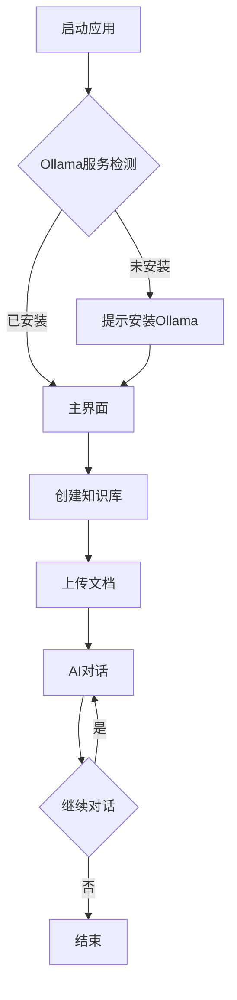

## 1. 产品概述
本地AI知识库桌面应用，基于Ollama实现完全离线的智能问答系统。用户可上传文档建立个人知识库，通过AI助手快速检索和问答。

解决隐私敏感场景下的知识管理需求，为个人和小型团队提供安全、高效的智能知识管理工具。

## 2. 核心功能

### 2.1 用户角色
| 角色 | 注册方式 | 核心权限 |
|------|----------|----------|
| 本地用户 | 首次启动创建 | 完整使用所有功能，数据本地存储 |

### 2.2 功能模块
本应用包含以下核心页面：
1. **主界面**: 知识库管理、AI对话、文件上传
2. **设置页面**: Ollama配置、模型选择、界面设置

### 2.3 页面详情
| 页面名称 | 模块名称 | 功能描述 |
|----------|----------|----------|
| 主界面 | 顶部导航栏 | 显示应用logo、当前知识库名称、设置入口 |
| 主界面 | 侧边栏 | 知识库列表、新建知识库、导入/导出功能 |
| 主界面 | 文件上传区 | 拖拽上传文档、支持PDF/TXT/MD格式、显示上传进度 |
| 主界面 | 对话区域 | AI助手对话框、输入框、发送按钮、对话历史 |
| 主界面 | 浮动操作按钮 | 快速新建对话、清除上下文、切换模型 |
| 设置页面 | Ollama配置 | 设置本地Ollama服务地址、端口、API配置 |
| 设置页面 | 模型管理 | 查看可用模型、切换默认模型、模型参数调整 |
| 设置页面 | 界面设置 | 主题切换、字体大小、语言设置 |

## 3. 核心流程
用户首次使用流程：
1. 启动应用，检测本地Ollama服务状态
2. 如未安装，提示用户安装Ollama并启动服务
3. 创建第一个知识库，上传初始文档
4. 开始与AI助手对话，基于上传的知识库内容回答问题

## 4. 用户界面设计

### 4.1 设计风格
- **主色调**: 深灰渐变背景（#1a1a1a到#2d2d2d）
- **强调色**: 奶油白按钮（#f5f5f0）配深色文字
- **字体**: 标题使用高对比度衬线字体（如Georgia），正文使用无衬线字体（如Inter）
- **按钮风格**: 圆角矩形，轻微悬浮效果
- **图标风格**: 简约线性图标，白色或浅灰色
- **布局风格**: 卡片式浮动布局，深色导航栏配浅色内容区

### 4.2 页面设计概述
| 页面名称 | 模块名称 | UI元素 |
|----------|----------|--------|
| 主界面 | 顶部导航 | 深色背景，白色"AI知识库"文字，左侧logo，右侧设置图标 |
| 主界面 | 侧边栏 | 半透明深色卡片，圆角边框，知识库列表带图标 |
| 主界面 | 文件上传 | 虚线边框拖拽区域，上传进度条，支持多文件同时上传 |
| 主界面 | 对话区 | 聊天气泡设计，用户消息右对齐蓝色，AI消息左对齐白色 |
| 主界面 | 浮动按钮 | 圆形悬浮按钮，带阴影效果，hover时显示工具提示 |
| 设置页面 | 配置卡片 | 浅色背景卡片，分组标题，输入框和选择器 |

### 4.3 响应式设计
桌面优先设计，支持窗口大小调整：
- 最小窗口尺寸：800x600px
- 侧边栏可折叠，适配小窗口
- 对话区域自动调整宽度
- 支持触摸板手势操作

### 4.4 桌面应用特性
- 系统托盘图标，支持最小化到托盘
- 全局快捷键唤醒（如Cmd+Shift+K）
- 本地文件系统访问权限
- 离线运行，无需网络连接
- 自动保存对话历史到本地数据库