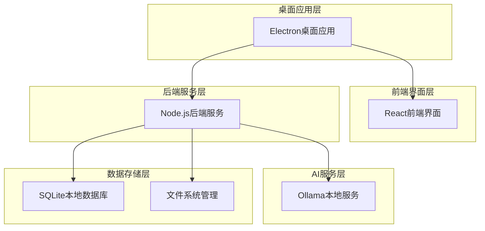
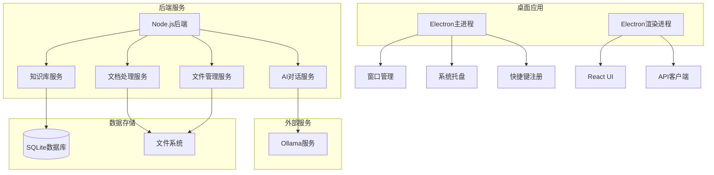
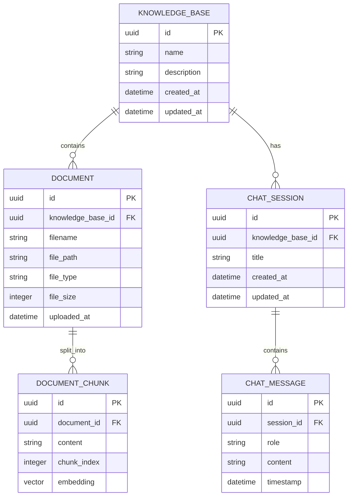

## 1. 架构设计



## 2. 技术描述

- **桌面框架**: Electron@27 + Vite@5
- **前端**: React@18 + TypeScript@5 + TailwindCSS@3
- **UI组件库**: shadcn/ui + Radix UI
- **后端**: Node.js@20 + Express@4
- **数据库**: SQLite3 + better-sqlite3
- **AI集成**: Ollama JavaScript SDK
- **文件处理**: pdf-parse + mammoth + markdown-it
- **初始化工具**: electron-vite

## 3. 路由定义

| 路由 | 用途 |
|------|------|
| / | 主界面，知识库管理和AI对话 |
| /settings | 设置页面，Ollama配置和模型管理 |
| /knowledge/:id | 特定知识库的对话界面 |

## 4. API定义

### 4.1 知识库管理API

```
GET /api/knowledge-bases
```
获取所有知识库列表

响应：
```json
[
  {
    "id": "uuid",
    "name": "string",
    "description": "string",
    "documentCount": "number",
    "createdAt": "datetime"
  }
]
```

```
POST /api/knowledge-bases
```
创建新知识库

请求：
```json
{
  "name": "string",
  "description": "string"
}
```

### 4.2 文档管理API

```
POST /api/documents/upload
```
上传文档到知识库

请求：
- FormData包含文件和knowledgeBaseId

```
DELETE /api/documents/:id
```
删除指定文档

### 4.3 AI对话API

```
POST /api/chat
```
发送消息给AI助手

请求：
```json
{
  "knowledgeBaseId": "uuid",
  "message": "string",
  "model": "string",
  "context": "string[]"
}
```

响应：
```json
{
  "response": "string",
  "context": "string[]",
  "tokenUsage": "number"
}
```

### 4.4 Ollama管理API

```
GET /api/ollama/models
```
获取可用模型列表

```
GET /api/ollama/status
```
检查Ollama服务状态

## 5. 服务器架构图



## 6. 数据模型

### 6.1 数据模型定义



### 6.2 数据定义语言

知识库表 (knowledge_bases)
```sql
CREATE TABLE knowledge_bases (
  id UUID PRIMARY KEY DEFAULT gen_random_uuid(),
  name VARCHAR(255) NOT NULL,
  description TEXT,
  created_at TIMESTAMP DEFAULT CURRENT_TIMESTAMP,
  updated_at TIMESTAMP DEFAULT CURRENT_TIMESTAMP
);

CREATE INDEX idx_knowledge_bases_created_at ON knowledge_bases(created_at DESC);
```

文档表 (documents)
```sql
CREATE TABLE documents (
  id UUID PRIMARY KEY DEFAULT gen_random_uuid(),
  knowledge_base_id UUID NOT NULL,
  filename VARCHAR(255) NOT NULL,
  file_path TEXT NOT NULL,
  file_type VARCHAR(50) NOT NULL,
  file_size INTEGER NOT NULL,
  uploaded_at TIMESTAMP DEFAULT CURRENT_TIMESTAMP,
  FOREIGN KEY (knowledge_base_id) REFERENCES knowledge_bases(id) ON DELETE CASCADE
);

CREATE INDEX idx_documents_knowledge_base_id ON documents(knowledge_base_id);
```

对话会话表 (chat_sessions)
```sql
CREATE TABLE chat_sessions (
  id UUID PRIMARY KEY DEFAULT gen_random_uuid(),
  knowledge_base_id UUID NOT NULL,
  title VARCHAR(255) NOT NULL,
  created_at TIMESTAMP DEFAULT CURRENT_TIMESTAMP,
  updated_at TIMESTAMP DEFAULT CURRENT_TIMESTAMP,
  FOREIGN KEY (knowledge_base_id) REFERENCES knowledge_bases(id) ON DELETE CASCADE
);

CREATE INDEX idx_chat_sessions_knowledge_base_id ON chat_sessions(knowledge_base_id);
```

对话消息表 (chat_messages)
```sql
CREATE TABLE chat_messages (
  id UUID PRIMARY KEY DEFAULT gen_random_uuid(),
  session_id UUID NOT NULL,
  role VARCHAR(20) NOT NULL CHECK (role IN ('user', 'assistant')),
  content TEXT NOT NULL,
  timestamp TIMESTAMP DEFAULT CURRENT_TIMESTAMP,
  FOREIGN KEY (session_id) REFERENCES chat_sessions(id) ON DELETE CASCADE
);

CREATE INDEX idx_chat_messages_session_id ON chat_messages(session_id);
CREATE INDEX idx_chat_messages_timestamp ON chat_messages(timestamp);
```